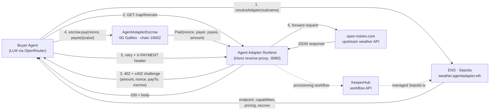

# Agent Adapter

> A TypeScript runtime that wraps any HTTP API or MCP server into a wallet-backed paid endpoint on EVM. Inspired by OpenClaw's vision of agents that transact without humans in the loop.

Buyer agents discover providers through ENS, pay through an on-chain escrow contract on 0G Galileo, and call upstream APIs through a Hono reverse-proxy — all without human-issued API keys.

## Architecture



**Two processes, two chains, three on-chain primitives.** The seller (Agent Adapter Runtime) is LLM-free — it's a deterministic Hono server. The buyer (the example agent) is LLM-driven so it can reason about which capability to call. KeeperHub provisions ENS records on the seller's behalf using its managed Sepolia wallet.

## Live deployments

| Network | Component | Address / Identifier |
|---|---|---|
| 0G Galileo (chain 16602) | `AgentAdapterEscrow` | [`0xc5b8ea3842A30D85424eAdAa00c8729ac6892214`](https://chainscan-galileo.0g.ai/address/0xc5b8ea3842A30D85424eAdAa00c8729ac6892214) |
| Ethereum Sepolia | Parent ENS name | `agentadapter.eth` |
| Ethereum Sepolia | Demo subname | `weather.agentadapter.eth` |
| Ethereum Sepolia | Resolver | [`0xE99638b40E4Fff0129D56f03b55b6bbC4BBE49b5`](https://sepolia.etherscan.io/address/0xE99638b40E4Fff0129D56f03b55b6bbC4BBE49b5) |
| KeeperHub | Demo workflow | `helloworld` (placeholder; see Roadmap) |

Sample Paid event on 0G Galileo (a buyer paying through the escrow):
[`0x0d5c9e6f7c16937ce524f83ebc7b6d541a0579ac1b98ccb585006d2ae3417398`](https://chainscan-galileo.0g.ai/tx/0x0d5c9e6f7c16937ce524f83ebc7b6d541a0579ac1b98ccb585006d2ae3417398)

## Bounty integrations

### 0G — escrow + framework

`AgentAdapterEscrow.sol` is the on-chain settlement layer. A buyer calls `pay(bytes32 nonce, address payee)` with native 0G as `msg.value`; the contract records the nonce, forwards funds to the payee in the same transaction, and emits `Paid(nonce, payer, payee, amount)`. The runtime watches for that event in the receipt logs before forwarding the upstream call — so a buyer's only trust is in the chain, not in the provider. Contract is compiled and tested with Foundry; runtime interactions use viem.

### ENS — discovery + identity

Each adapter mints a subname under a parent name owned by the provider (here, `weather.agentadapter.eth` under `agentadapter.eth`). A single text record `agent.adapter.manifest` holds a JSON manifest with the wallet address, HTTP endpoint, capability list, per-capability pricing, payment chain id, and escrow address. The buyer agent reads this manifest with one ENS lookup — no off-chain index, no marketplace API.

### KeeperHub — managed on-chain provisioning

The runtime's KeeperHub plugin (`packages/keeperhub`) issues authenticated POST requests to `/api/mcp/workflows/{slug}/call`. The hackathon demo invokes KeeperHub's `helloworld` workflow as a connectivity proof — real auth, real executionId, real async execution. Production deployments wire a custom Web3-plugin workflow (paid for in Sepolia ETH from KeeperHub's managed org wallet) that publishes the ENS subname registration and text records on the provider's behalf, eliminating the need for the seller process to hold or manage Sepolia gas.

## Quickstart

Prerequisites: Node.js 20+, pnpm, Foundry (for the Solidity layer).

```bash
git clone https://github.com/AGICitizens/agent-adapter.git
cd agent-adapter
pnpm install

# 1) Configure environment
cp .env.example .env
# Edit .env — fill in PRIVATE_KEY, OPENROUTER_API_KEY, KEEPERHUB_API_KEY, etc.

# 2) Configure runtime (uses ${VAR} interpolation from .env)
cp agent-adapter.example.yaml agent-adapter.yaml

# 3) Build all packages
pnpm build

# 4) Run the end-to-end demo
pnpm demo
```

The demo orchestrator (`apps/demo`) boots the seller runtime + buyer agent in separate Node processes, parses their structured event streams, and renders the round-by-round flow in a single terminal.

## What `pnpm demo` does

1. **Phase 1 — Infrastructure Setup.** Loads config, checks buyer + seller wallet balances on 0G Galileo, verifies escrow address, triggers the KeeperHub workflow (returns an executionId), resolves the provider's manifest from ENS on Sepolia, boots the seller's reverse-proxy server.
2. **Phase 2 — Buyer Goal.** Prints the natural-language goal (e.g. *"Get the current temperature in Tokyo"*).
3. **Phase 3 — Buyer Loop.** The LLM-driven buyer picks tools across multiple rounds: `resolve_provider` reads the ENS manifest; `request_capability` calls the seller, handles the 402 challenge by signing and broadcasting an `escrow.pay()` transaction on 0G, retries with the `X-PAYMENT` header, and gets the upstream response; `report_result` finalizes.
4. **Phase 4 — Results.** Aggregated stats: rounds, tool calls, payment tx hashes (linked to the explorer), final answer.

End-to-end runtime: ~15–20 seconds. Full transaction trail visible on https://chainscan-galileo.0g.ai.

## Repository layout

```
packages/
  contracts/       Shared TS interfaces (wallet, payment, store, extension, identity)
  runtime/         Hono server, YAML config loader, capability mapping, reverse-proxy verify-and-forward
  wallet-evm/      viem-based EVM wallet plugin (multi-chain via single key)
  payment-x402/    HTTP 402 challenge issuer + on-chain Paid-event verifier
  ens-identity/    ENS text-record manifest reader (Sepolia + mainnet via viem presets)
  keeperhub/       Authenticated REST client for KeeperHub workflow execution
apps/
  buyer-agent/     LLM-driven buyer (OpenRouter, tool-calling agent loop)
  demo/            Terminal orchestrator (chalk + boxen, spawns seller + buyer)
solidity/
  src/             AgentAdapterEscrow contract
  test/            Foundry unit tests
  script/          Deploy script for 0G Galileo
```

## Configuration

The runtime reads `agent-adapter.yaml`. Secrets are pulled from `.env` via `${VAR}` interpolation — never inlined in YAML, never committed.

Key environment variables:

| Variable | Purpose |
|---|---|
| `PRIVATE_KEY` | Seller's signing key on both 0G Galileo and Sepolia |
| `BUYER_PRIVATE_KEY` | Buyer's signing key on 0G Galileo (optional; falls back to `PRIVATE_KEY`) |
| `ZG_RPC_URL` | 0G Galileo RPC (default `https://evmrpc-testnet.0g.ai`) |
| `ZG_ESCROW_ADDRESS` | Deployed escrow address on 0G |
| `SEPOLIA_RPC_URL` | Sepolia RPC for ENS reads |
| `ENS_PARENT_NAME` | Provider's parent ENS name (e.g. `agentadapter.eth`) |
| `KEEPERHUB_API_KEY` | Bearer token for KeeperHub workflows |
| `KEEPERHUB_IDENTITY_WORKFLOW_SLUG` | Slug of the KeeperHub workflow that publishes identity (e.g. `helloworld`) |
| `OPENROUTER_API_KEY` | OpenRouter API key for the buyer's LLM loop |
| `LLM_MODEL` | Model id (default `google/gemini-2.0-flash-001`) |

## Security

- Wallet private keys are read only from `process.env` at boot, never inlined in code, never committed (gitignore covers `.env*` and `agent-adapter.yaml`).
- The pino logger has a redact list for `*.privateKey`, `*.apiKey`, and named env vars — even an accidental config dump is censored.
- Buyer-issued nonces are 32 bytes from `crypto.randomBytes`. Replay protection is enforced at two layers: an in-memory `consumedNonces` set in the adapter, and the on-chain `consumedNonces` mapping in the escrow contract.
- The reverse-proxy validates the X-PAYMENT header structure with a strict zod schema before any RPC calls; malformed headers return 400 without touching the chain.
- Trust boundaries: ENS reads, KeeperHub responses, and the buyer's LLM tool-call arguments are all validated with zod before passing to network or wallet code.

## Demo aesthetic

The terminal orchestrator mirrors the structured action-log style established by previous OpenClaw-inspired agent demos:

- Magenta opening + closing banners
- Cyan section rules (`── Phase Name ──`)
- Three-letter action tags color-coded by category: `NET` (HTTP), `KEY` (signing), `SEC` (secret storage), `DB` (persistence), `CAP` (capability execution), `JOB` (job queue), `SYS` (runtime)
- `Round N → 1 tool call` markers with per-round latency

Implemented with `chalk` + `boxen`. The buyer-agent emits structured JSON events to stdout; the orchestrator parses each line and renders it. Logic and presentation stay separated.

## Roadmap

- Replace the `helloworld` demo placeholder with a custom KeeperHub workflow that wires the Web3 plugin to ENS Registry's `setSubnodeRecord` + Resolver's `setText` on Sepolia, so the seller no longer needs to manage Sepolia gas.
- Persist `consumedNonces` and capability state in the runtime store (currently in-memory) for production deployments.
- Multi-capability support and OpenAPI auto-discovery for arbitrary upstream APIs.
- Optional agent-led mode embedded in the runtime (LLM loop colocated with the seller).

## License

MIT — see [LICENSE](./LICENSE).
