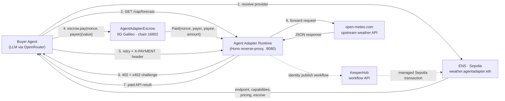

# Agent Adapter

> A TypeScript runtime that turns any HTTP API into a paid endpoint on EVM.

Buyers discover providers through ENS, pay through an on-chain escrow on 0G Galileo, and call upstream APIs through a reverse-proxy runtime. The goal is simple: paid agent-to-agent API access with no API keys, no centralized marketplace, and no human in the loop.

## What this project does

- Wraps an HTTP API behind a payment-gated runtime
- Uses ENS on Sepolia for provider discovery and metadata
- Uses an EVM escrow contract on 0G Galileo for x402-style payments
- Includes a buyer agent that resolves a provider, pays, retries, and returns the result
- Includes KeeperHub integration for managed ENS publishing workflows

## Architecture



The seller runtime is deterministic and LLM-free. The buyer agent is LLM-driven so it can reason about which provider and capability to use. The payment proof comes from the chain, not from trust in the seller.

## Live deployments

| Network | Component | Address / Identifier |
|---|---|---|
| 0G Galileo | Escrow contract | [`0xc5b8ea3842A30D85424eAdAa00c8729ac6892214`](https://chainscan-galileo.0g.ai/address/0xc5b8ea3842A30D85424eAdAa00c8729ac6892214) |
| Ethereum Sepolia | ENS parent | `agentadapter.eth` |
| Ethereum Sepolia | Demo subname | `weather.agentadapter.eth` |
| 0G Galileo | Sample paid call | [`0x0d5c9e6f7c16937ce524f83ebc7b6d541a0579ac1b98ccb585006d2ae3417398`](https://chainscan-galileo.0g.ai/tx/0x0d5c9e6f7c16937ce524f83ebc7b6d541a0579ac1b98ccb585006d2ae3417398) |

## Bounty integrations

### 0G

`solidity/src/AgentAdapterEscrow.sol` is the payment settlement layer. A buyer calls `pay(bytes32 nonce, address payee)` with native value. The contract records the nonce, forwards the funds immediately, and emits `Paid(nonce, payer, payee, amount)`. The runtime verifies that event before releasing the protected API response.

This gives the project a real on-chain payment path on an EVM-compatible AI-focused chain rather than a mock payment flow.

### ENS

Providers are discovered through ENS subnames on Sepolia. A subname stores the provider manifest in text records, including:

- endpoint
- capabilities
- pricing
- payment chain id
- escrow address
- wallet address

The buyer agent resolves that identity at runtime, so discovery is functional and not hard-coded into the buyer flow.

### KeeperHub

KeeperHub is used as the managed execution layer for ENS publishing workflows. In the current codebase, the demo can call a configured KeeperHub workflow to publish provider identity to ENS. If KeeperHub is not configured, the demo falls back to already-published ENS records so the end-to-end payment flow still works.

This gives the project a credible operational story: the provider runtime does not need to directly manage Sepolia gas for identity provisioning.

## Demo flow

`pnpm demo` runs the full end-to-end path:

1. Loads config and environment
2. Checks buyer and seller balances on 0G Galileo
3. Optionally triggers KeeperHub to publish the ENS identity
4. Resolves the provider on Sepolia through ENS
5. Starts the seller runtime
6. Starts the buyer agent with a natural-language goal
7. Buyer receives a `402` challenge, pays through the escrow contract, retries the call, and returns the upstream result

The default demo provider wraps the Open-Meteo API and exposes a `forecast` capability.

## Quickstart

Prerequisites:

- Node.js 20+
- pnpm
- Foundry

```bash
git clone https://github.com/AGICitizens/agent-adapter.git
cd agent-adapter
pnpm install

cp .env.example .env
cp agent-adapter.example.yaml agent-adapter.yaml

pnpm build
pnpm demo
```

The demo typically completes in about 15-20 seconds and produces a real payment transaction on 0G Galileo.

## Configuration

The runtime reads `agent-adapter.yaml`. Secrets are injected via `${VAR}` interpolation from `.env`.

Key environment variables:

| Variable | Purpose |
|---|---|
| `PRIVATE_KEY` | Seller wallet private key |
| `BUYER_PRIVATE_KEY` | Buyer wallet private key; optional fallback to `PRIVATE_KEY` |
| `ZG_RPC_URL` | 0G Galileo RPC |
| `ZG_ESCROW_ADDRESS` | Deployed escrow contract address |
| `SEPOLIA_RPC_URL` | Sepolia RPC for ENS reads |
| `ENS_PARENT_NAME` | Parent ENS name, such as `agentadapter.eth` |
| `KEEPERHUB_API_KEY` | KeeperHub API token |
| `KEEPERHUB_IDENTITY_WORKFLOW_SLUG` | KeeperHub workflow slug for ENS publishing |
| `OPENROUTER_API_KEY` | OpenRouter API key for the buyer agent |
| `LLM_MODEL` | Model id for the buyer agent |

The sample runtime config in [`agent-adapter.example.yaml`](./agent-adapter.example.yaml) exposes one capability:

- `forecast` -> forwards to Open-Meteo `/v1/forecast`

## Repository layout

```text
packages/
  contracts/       shared TypeScript interfaces
  runtime/         Hono runtime, config loader, reverse-proxy
  wallet-evm/      viem wallet integration
  payment-x402/    x402 challenge issuing and on-chain verification
  ens-identity/    ENS text-record resolver
  keeperhub/       KeeperHub workflow client
apps/
  buyer-agent/     LLM-driven buyer agent
  demo/            terminal demo orchestrator
solidity/
  src/             escrow contract
  script/          deployment script
  test/            Foundry tests
```

## Security notes

- Private keys are read from `process.env` and are not committed
- `.env` and `agent-adapter.yaml` are gitignored; only example files are tracked
- Runtime logs redact common secret fields
- Replay protection exists both in memory and on-chain through `consumedNonces`
- Payment verification happens against real transaction receipts and emitted events

## Submission notes

For hackathon submission, the repo already includes:

- public source code
- setup instructions
- architecture overview
- contract deployment address
- a working example agent flow
- explanation of 0G, ENS, and KeeperHub usage

Before final submission, add or confirm:

- project description in the ETHGlobal form
- team member names and contact info in the submission form
- demo video link
- live demo link or clear local demo instructions
- explicit disclosure if any part of the work is adapted from earlier pre-hackathon code

## Roadmap

- Persist nonce and capability state in the runtime store instead of in-memory maps
- Expand beyond manual capability definitions into full OpenAPI-driven discovery
- Support richer payment rails and more provider capabilities
- Replace fallback identity assumptions with a production-ready KeeperHub ENS publishing workflow

## License

MIT. See [`LICENSE`](./LICENSE).
